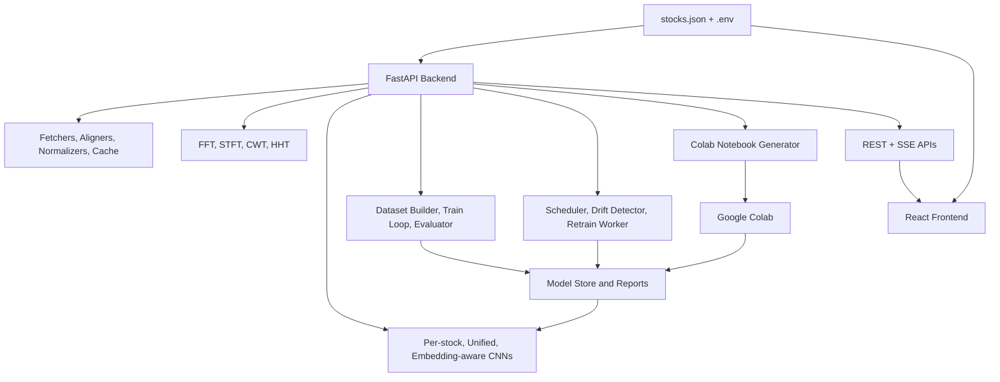

# ChronoSpectra Architecture

This document describes the current architecture of ChronoSpectra and records the key design decisions that shape the codebase today.

## 1. Current System Shape

ChronoSpectra is a two-service application with a shared configuration spine:

- FastAPI backend
- React + TypeScript frontend
- shared root `stocks.json`

The backend owns:

- data fetching
- alignment and normalization
- signal processing
- model loading and inference
- notebook generation
- training and retraining orchestration
- live and progress SSE streams

The frontend owns:

- route-based application shell
- chart rendering
- signal-analysis controls
- live monitoring UX
- training and model-comparison views
- educational walkthroughs

## 2. High-Level Architecture

## 3. Runtime Responsibilities

### Backend

Main backend entry points:

- `backend/main.py`
- `backend/config.py`
- `backend/startup_actions.py`

Core backend packages:

- `backend/data/`
- `backend/signal_processing/`
- `backend/models/`
- `backend/training/`
- `backend/retraining/`
- `backend/routes/`

### Frontend

Main frontend entry points:

- `frontend/src/main.tsx`
- `frontend/src/App.tsx`
- `frontend/src/router/appRoutes.tsx`

Core frontend areas:

- `frontend/src/api/`
- `frontend/src/components/`
- `frontend/src/hooks/`
- `frontend/src/pages/`
- `frontend/src/types/`

## 4. Architectural Decisions

## ADR-001: FastAPI As The Backend Framework

**Status:** Accepted

### Context

The project needs:

- typed JSON responses
- automatic API docs
- server-sent events
- background workflows that cooperate with the web server

### Decision

Use FastAPI.

### Consequences

- Pydantic-backed route contracts
- built-in `/docs` and `/redoc`
- natural fit for SSE and startup coordination

## ADR-002: Vite + React As A Route-Based SPA

**Status:** Accepted

### Context

The UI is an application dashboard, not a content site. It needs client-side routing and page-local heavy views such as live SSE and animation-driven explainers.

### Decision

Use Vite + React + TypeScript with React Router.

### Consequences

- fast local iteration
- lazy-loaded page routes
- live and animation-heavy work stays isolated to the active route

## ADR-003: `stocks.json` As The Shared System Spine

**Status:** Accepted

### Context

The specification describes a config-driven application where stocks, exchanges, transforms, training settings, and retraining rules should remain aligned across backend and frontend.

### Decision

Use one shared root `stocks.json` file across the system.

### Consequences

- frontend and backend stock lists stay synchronized
- training notebooks can be generated from the same config
- provider, exchange, and transform changes become mostly declarative

## ADR-004: Swappable Boundaries Through Focused Modules

**Status:** Accepted

### Context

The project needs multiple providers, multiple signal transforms, and multiple model variants.

### Decision

Keep these concerns behind focused module boundaries:

- data fetchers
- signal transforms
- model registry

### Consequences

- routes remain thin
- provider and model choices stay centralized
- future broker activation work has a clear insertion point

## ADR-005: Colab Training With Local Inference

**Status:** Accepted

### Context

GPU-heavy training is a better fit for Colab or external compute, but the local application still needs to load trained checkpoints and serve predictions.

### Decision

Treat Colab as the preferred training environment while keeping local CPU-only inference available.

### Consequences

- generated notebooks are first-class
- local runtime uses `backend/requirements.runtime.txt`
- local backend does not need CUDA or NVIDIA wheels for normal use
- backend still depends on CPU PyTorch for `.pth` loading and inference

## ADR-006: Graph-First, Route-Scoped Frontend UX

**Status:** Accepted

### Context

The application is visualization-heavy, and several pages can easily become cramped or confusing without explicit visual hierarchy.

### Decision

Favor:

- large lead charts
- route-scoped page responsibilities
- query/path-driven stock context
- inline onboarding and hover help for first-time users

### Consequences

- stock detail and signal analysis prioritize large primary visuals
- live streams only run on the live page
- the frontend can guide novice users without changing backend complexity

## ADR-007: Startup Actions Are Explicit And Ordered

**Status:** Accepted

### Context

The app supports startup local training and startup retraining refresh, but running both automatically would be redundant and confusing.

### Decision

Make startup work explicit and prioritize local training when both flags are enabled.

### Consequences

- startup behavior is predictable
- startup action state is inspectable on the app
- `local_training.enabled` takes precedence over `retrain_on_startup.enabled`

## ADR-008: Compatibility Without Polluting The Primary API Surface

**Status:** Accepted

### Context

Older callers still use `/api/*` path prefixes, while the current primary API surface is unprefixed.

### Decision

Expose hidden `/api/*` aliases while keeping the documented API canonical and unprefixed.

### Consequences

- older callers keep working
- FastAPI docs stay clean
- the repo avoids duplicating route logic

## 5. Backend Subsystems

### Data Layer

Responsibilities:

- fetch historical OHLCV
- fetch fundamentals
- fetch market index data
- fetch USD-INR data
- align daily and quarterly tracks
- cache recent fetch results

Key modules:

- `backend/data/base_fetcher.py`
- `backend/data/fetchers/`
- `backend/data/aligners/`
- `backend/data/normalizers/`
- `backend/data/cache/data_cache.py`

### Signal Layer

Responsibilities:

- build FFT outputs
- generate spectrograms
- generate STFT frame sequences for the explainer

Key modules:

- `backend/signal_processing/base_transform.py`
- `backend/signal_processing/transforms/`
- `backend/signal_processing/fft_visualizer.py`
- `backend/signal_processing/spectrogram_generator.py`
- `backend/signal_processing/price_signal_loader.py`

### Model Layer

Responsibilities:

- define model classes
- resolve trained artifacts
- run prediction inference

Key modules:

- `backend/models/base_model.py`
- `backend/models/per_stock_cnn.py`
- `backend/models/unified_cnn.py`
- `backend/models/unified_cnn_with_embeddings.py`
- `backend/models/model_registry.py`

### Training Layer

Responsibilities:

- build datasets
- run training loops
- evaluate models
- generate notebooks
- stream training progress state

Key modules:

- `backend/training/dataset_builder.py`
- `backend/training/train_loop.py`
- `backend/training/evaluator.py`
- `backend/training/notebook_generator.py`
- `backend/training/runtime_state.py`

### Retraining Layer

Responsibilities:

- check retrain cadence
- detect drift
- execute retraining
- persist retraining history
- stream retraining progress state

Key modules:

- `backend/retraining/scheduler.py`
- `backend/retraining/drift_detector.py`
- `backend/retraining/retrain_worker.py`
- `backend/retraining/runtime_state.py`

## 6. Frontend Structure

The frontend is built around route-level pages:

- `/`
- `/stock/:id`
- `/signal/:id`
- `/compare`
- `/live`
- `/explainer`
- `/training`

Important frontend patterns:

- theme state is persisted
- stock context lives in the URL
- shared chart cards handle loading, empty, error, and retry states
- page guides and hover hints reduce friction for new users

## 7. Data and Artifact Flow

### Inference Path

1. Load stock config.
2. Fetch and cache recent data.
3. Normalize the price signal.
4. Transform the signal into a spectrogram-like input.
5. Load checkpoint and scaler artifacts.
6. Run model inference.
7. Return REST or SSE payloads to the frontend.

### Training Path

1. Build a chronological dataset.
2. Train the selected model mode.
3. Evaluate on held-out data.
4. Save checkpoint, scaler, and training report.
5. Surface those artifacts through model/training endpoints.

### Retraining Path

1. Scheduler or manual trigger starts retraining.
2. Drift and cadence status are evaluated.
3. Retrain worker regenerates artifacts.
4. Reports, logs, and prediction history are updated.
5. Frontend training and comparison pages reflect the new outputs.

## 8. Trade-Offs

### Why `yfinance` First

Pros:

- fast to integrate
- enough for historical data and delayed live snapshots

Trade-off:

- not real-time
- broker-backed production activation still needs Zerodha or Angel One completion

### Why CPU-Only Local Runtime

Pros:

- avoids heavyweight local CUDA dependency chains
- simpler for local development

Trade-off:

- local training is slower than GPU-backed environments
- Colab remains the better option for heavy training

### Why Route-Scoped Heavy Views

Pros:

- avoids unnecessary live connections
- limits expensive rendering to active pages

Trade-off:

- more URL-driven state management
- page-specific hooks instead of one global data layer

## 9. Known Constraint

The only long-standing verification-only gap is checking the open-market SSE behavior during a live NSE session. The closed-market path is implemented and verified, but open-session live validation still depends on real market hours.

## 10. Related Documents

- [`README.md`](./README.md)
- [`DOCUMENTATION.md`](./DOCUMENTATION.md)
- [`API_REFERENCE.md`](./API_REFERENCE.md)
- [`ASSIGNMENT_ALIGNMENT.md`](./ASSIGNMENT_ALIGNMENT.md)
