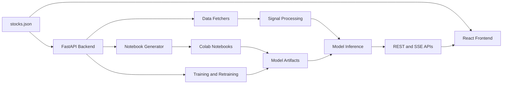

# ChronoSpectra Documentation

This document is the main project manual for ChronoSpectra. It explains what the system does, how the repo is organized, how to run it, how configuration works, how training and retraining fit together, and how to troubleshoot common issues.

## 1. Overview

ChronoSpectra is a financial time-series forecasting application built around one shared configuration file and two main services:

- a FastAPI backend
- a React + TypeScript frontend

The application combines:

- market and fundamentals ingestion
- signal-processing transforms such as FFT, STFT, CWT, and HHT
- CNN-based forecasting
- notebook generation for Colab training
- local training and retraining flows
- live monitoring and educational visualizations

The repo is designed so that the same `stocks.json` file drives:

- enabled stocks
- exchange metadata
- signal parameters
- training defaults
- retraining rules
- frontend stock navigation

## 2. System Flow



In practice, the lifecycle is:

1. The backend loads configuration and environment values.
2. Data fetchers pull historical prices, fundamentals, market index data, and USD-INR data.
3. Signal-processing modules transform the normalized price series into frequency-domain or time-frequency representations.
4. CNN models consume spectrogram-like inputs to make future price predictions.
5. Generated notebooks or backend training flows create `.pth`, scaler, report, and history artifacts.
6. The frontend consumes backend APIs to render charts, comparisons, live monitoring views, and explanations.

## 3. Repository Structure

```text
StockCNN/
├── backend/
│   ├── data/
│   ├── models/
│   ├── notebooks/
│   ├── retraining/
│   ├── routes/
│   ├── signal_processing/
│   ├── training/
│   ├── config.py
│   ├── main.py
│   ├── requirements.runtime.txt
│   └── requirements.txt
├── frontend/
│   ├── src/
│   │   ├── api/
│   │   ├── components/
│   │   ├── config/
│   │   ├── hooks/
│   │   ├── pages/
│   │   ├── router/
│   │   └── types/
│   └── package.json
├── docker-compose.yml
├── stocks.json
├── README.md
├── DOCUMENTATION.md
├── API_REFERENCE.md
├── ARCHITECTURE.md
└── ASSIGNMENT_ALIGNMENT.md
```

Important root files:

- `stocks.json`: shared runtime configuration
- `.env`: shared local environment values
- `docker-compose.yml`: local development workflow
- `README.md`: quick-start entry point
- `API_REFERENCE.md`: backend route guide

## 4. Core Concepts

### Shared Configuration

`stocks.json` is the central spine of the application. Both backend and frontend read from it.

It defines:

- `model_mode`
- `local_training`
- `retrain_on_startup`
- exchanges and market hours
- enabled stocks
- signal-processing defaults
- training settings
- retraining policy

### Model Modes

The backend supports four modes:

| Mode | Meaning |
|---|---|
| `per_stock` | one dedicated model per stock |
| `unified` | one shared model across all stocks |
| `unified_with_embeddings` | one shared model with stock identity embeddings |
| `both` | comparison-oriented configuration that exposes multiple modes |

When the configured prediction mode is unavailable locally, the backend can fall back to a trained per-stock artifact for inference.

### Local Runtime vs Training Runtime

There are two backend dependency entry points:

| File | Intended Use |
|---|---|
| `backend/requirements.runtime.txt` | normal local backend runtime with CPU-only PyTorch |
| `backend/requirements.txt` | fuller environment for broader backend/training work |

If training happens in Google Colab, local CUDA packages are unnecessary. Local inference still needs CPU PyTorch because the backend loads `.pth` checkpoints directly.

### Artifacts

Key artifacts are written under:

- `backend/models/model_store/per_stock/`
- `backend/models/model_store/unified/`
- `backend/models/model_store/scalers/`
- `backend/models/model_store/reports/`
- `backend/retraining/prediction_history/`
- `backend/retraining/retrain_log.json`

These files power:

- `/model/predict/*`
- `/model/compare/*`
- `/model/backtest/*`
- training detail views
- retraining history and drift detection

## 5. Prerequisites

Recommended local tools:

- Python 3.12
- Node.js 22
- npm
- Docker Desktop and Docker Compose for the easiest local startup

## 6. Setup

### Environment Files

The backend loads environment values from:

- root `.env`
- `backend/.env`
- `frontend/.env`

The frontend reads `VITE_BACKEND_URL` from env at build/dev time.

Example `.env`:

```env
BACKEND_URL=http://localhost:8000
FRONTEND_URL=http://localhost:5173
VITE_BACKEND_URL=http://localhost:8000

ZERODHA_API_KEY=
ZERODHA_ACCESS_TOKEN=
ANGEL_ONE_API_KEY=
ANGEL_ONE_CLIENT_ID=
ANGEL_ONE_PASSWORD=
ANGEL_ONE_TOTP_SECRET=

APP_ENV=development
LOG_LEVEL=INFO
```

### Docker Setup

```bash
docker compose up --build
```

What Docker Compose does here:

- starts the backend on `:8000`
- installs backend dependencies from `backend/requirements.runtime.txt`
- starts the frontend on `:5173`
- mounts `stocks.json` into both services

### Manual Setup

Backend:

```bash
cd backend
python -m pip install -r requirements.runtime.txt
uvicorn main:app --host 0.0.0.0 --port 8000 --reload
```

Frontend:

```bash
cd frontend
npm install
npm run dev
```

## 7. Configuration Guide

### 7.1 Top-Level `stocks.json` Keys

| Key | Purpose |
|---|---|
| `app_name` | API/application display name |
| `version` | app version exposed by backend metadata |
| `model_mode` | active prediction/training mode |
| `local_training` | local training-on-startup configuration |
| `retrain_on_startup` | retraining refresh on startup |
| `exchanges` | exchange metadata, market hours, providers |
| `stocks` | enabled stock list and per-stock metadata |
| `signal_processing` | transform defaults |
| `training` | split and optimizer defaults |
| `retraining` | retraining cadence and drift thresholds |

### 7.2 Add a Stock

Add a new object under `stocks`:

```json
{
  "id": "SBIN",
  "ticker": "SBIN.NS",
  "display_name": "State Bank of India",
  "exchange": "NSE",
  "sector": "Banking",
  "color": "#2EC4B6",
  "enabled": true,
  "model": {
    "retrain_interval_days": 30,
    "prediction_horizon_days": 5,
    "training_data_years": 5
  }
}
```

Checklist when adding a stock:

- make sure `exchange` exists in `exchanges`
- use a unique `id`
- pick a unique `color`
- keep `ticker` aligned with the provider naming format

### 7.3 Change a Live Data Provider

Update the exchange block:

```json
"NSE": {
  "live_data_provider": "zerodha"
}
```

Then:

1. fill the corresponding credentials in `.env`
2. restart the backend

Current reality:

- `yfinance` is fully implemented
- Zerodha and Angel One are documented stubs, ready for future activation work

### 7.4 Startup Flags

`local_training.enabled`:

- starts local training on backend startup
- intended for offline regeneration workflows

`retrain_on_startup.enabled`:

- runs a startup stale-or-missing model refresh

Precedence rule:

- if both are `true`, `local_training` wins and startup retraining is skipped

## 8. Frontend User Guide

The frontend is intentionally route-based so live streams and heavier charts only run when their pages are active.

### Dashboard (`/`)

Use this page for:

- market-wide overview across enabled stocks
- normalized comparison chart
- exchange status and retraining summary
- stock-level drill-down entry points

### Stock Detail (`/stock/:id`)

Use this page for:

- larger price charts
- revenue and profit charts
- market index and USD-INR context
- shared daily range comparisons

### Signal Analysis (`/signal/:id`)

Use this page for:

- FFT inspection
- spectrogram viewing
- transform switching between STFT, CWT, and HHT
- parameter exploration
- energy and dominant-frequency support charts

### Model Comparison (`/compare`)

Use this page for:

- side-by-side model mode comparison
- saved metrics review
- backtest overlay inspection
- embedding projection view

Stock selection on this page is query-based.

### Live Testing (`/live`)

Use this page for:

- latest actual vs predicted monitoring
- market-open vs after-hours status
- stream state awareness
- recent prediction table review

Important live behavior:

- when the market is closed, the page shows the last snapshot plus countdown data
- the SSE stream sends one payload and closes during after-hours mode

### How It Works (`/explainer`)

Use this page for:

- educational walkthrough of the STFT-to-CNN pipeline
- synchronized frame-by-frame explanation of the prediction flow
- the CNN architecture diagram rendered from the real backend layer stack, including the optional embedding branch

### Training (`/training`)

Use this page for:

- notebook downloads
- loss curve review
- drift review
- retraining triggers and history

## 9. Training and Retraining Workflows

### 9.1 Colab Notebook Workflow

This is the recommended training path if you want external compute.

1. Call `GET /notebook/generate?mode=...`
2. Download the notebook
3. Run it in Google Colab
4. copy the produced artifacts back into the backend artifact directories

Typical modes:

- `per_stock`
- `unified`
- `unified_with_embeddings`
- `both`

### 9.2 Backend Local Training Workflow

Use:

- `POST /training/start`
- `GET /training/progress`
- `GET /training/report`
- `GET /training/report-detail/{stock_id}`

This is useful when you want the backend to regenerate artifacts locally.

### 9.3 Retraining Workflow

Use:

- `POST /retraining/trigger/{stock_id}` for a blocking manual retrain
- `POST /retraining/start/{stock_id}` for runtime-tracked retraining with progress SSE
- `POST /retraining/trigger-all` for all enabled stocks
- `GET /retraining/status`
- `GET /retraining/logs`
- `GET /retraining/progress`

### 9.4 Drift Detection

Retraining status combines:

- age/cadence checks
- drift diagnostics from recent prediction history

The retraining policy is configured under:

- `retraining.check_interval_hours`
- `retraining.drift_threshold_multiplier`

## 10. Artifacts and Persistence

### Model Weights

- per-stock weights: `backend/models/model_store/per_stock/`
- shared weights: `backend/models/model_store/unified/`

### Scalers

- `backend/models/model_store/scalers/`

### Reports

- `backend/models/model_store/reports/`

### Prediction History

- `backend/retraining/prediction_history/`

### Retraining Log

- `backend/retraining/retrain_log.json`

These artifacts are required for the richer model-comparison, training, and backtest views.

## 11. API Surface

The backend exposes:

- health and config endpoints
- data endpoints
- signal-processing endpoints
- model inference and comparison endpoints
- training endpoints
- retraining endpoints
- live-monitoring endpoints
- notebook generation

For the full route list and parameter details, see [`API_REFERENCE.md`](./API_REFERENCE.md).

FastAPI-generated interactive docs are available at:

- `http://localhost:8000/docs`
- `http://localhost:8000/redoc`

Compatibility note:

- hidden `/api/*` aliases exist for older callers
- the primary documented surface remains the unprefixed routes

## 12. Troubleshooting

### Backend Is Downloading Huge NVIDIA Wheels

Cause:

- using `backend/requirements.txt` or generic `torch` install paths locally

Fix:

- use `backend/requirements.runtime.txt`
- use Docker Compose as provided

### `model_not_trained` Errors

Cause:

- no `.pth`, scaler, or report artifacts exist for the requested stock/mode

Fix:

- run a Colab notebook and place artifacts into the model store
- or trigger local training/retraining

### Frontend Shows `Failed to fetch`

Cause:

- backend is not running
- `VITE_BACKEND_URL` is wrong
- CORS origin does not match `FRONTEND_URL`

Fix:

- confirm backend is running on `:8000`
- confirm `.env` values
- check browser network requests

### Live Page Does Not Stay Connected After Hours

This is expected behavior.

When the market is closed:

- the backend sends one snapshot
- includes `next_open_at` and `seconds_until_open`
- closes the SSE stream

### YFinance Data Looks Delayed

This is expected with `yfinance`.

For real-time broker-backed flows, the repo is structured for future Zerodha and Angel One activation work.

## 13. Verification Commands

Frontend:

```bash
cd frontend
npm run type-check
npm run lint
npm run build
```

Backend:

```bash
cd d:/StockCNN
python -m compileall backend
```

Optional:

```bash
cd frontend
npm run test:e2e
```

## 14. Documentation Map

- [`README.md`](./README.md): quickest way to get running
- [`DOCUMENTATION.md`](./DOCUMENTATION.md): full manual
- [`API_REFERENCE.md`](./API_REFERENCE.md): route-by-route backend reference
- [`ARCHITECTURE.md`](./ARCHITECTURE.md): design decisions and current architecture
- [`ASSIGNMENT_ALIGNMENT.md`](./ASSIGNMENT_ALIGNMENT.md): assignment mapping
