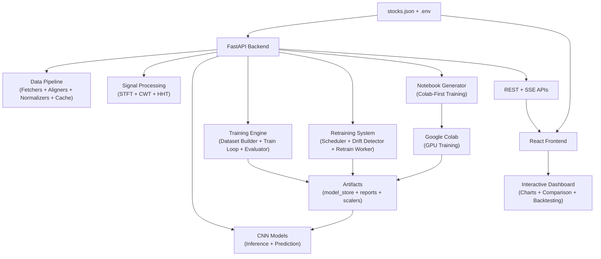

# ChronoSpectra

[](https://chronospectra.gabrieljames.me/)


> **Advanced Time-Series Forecasting Platform**
> A full-stack financial forecasting system combining signal processing, CNN-based deep learning, and real-time visualization

ChronoSpectra is a **production-ready**, configuration-driven platform that transforms raw market data into actionable stock price forecasts. Built with a FastAPI backend and React + TypeScript frontend, it orchestrates a sophisticated pipeline: data fetching → signal transformation (STFT/CWT/HHT) → CNN inference → real-time visualization. The system enables live monitoring, model comparison, automated retraining, and drift-aware refresh cycles for sustained prediction accuracy.

---

## What Problems Does This Solve?

**The Challenge:**
- Stock price prediction requires multi-scale temporal pattern recognition across varying market conditions
- Naive time-series models struggle with non-stationary data and hidden periodicities
- Most ML market forecasts are research-only; integrating them into full-stack applications is non-trivial
- Maintaining production model accuracy over time requires sophisticated drift detection and retraining orchestration

**The Solution:**
ChronoSpectra addresses these by:
- Using advanced signal transforms to decompose market data into interpretable frequency and time-frequency domains
- Leveraging CNNs to capture local temporal patterns across multiple time scales
- Providing a configuration-first architecture that adapts to different market regimes without code changes
- Including automated retraining pipelines with drift detection to maintain model performance
- Offering real-time validation, backtesting, and model comparison tools built directly into the UI

## Architecture Highlights

### Core Strengths

| **Aspect** | **Implementation** |
|---|---|
| **Data Pipeline** | Fault-tolerant multi-source ingestion with alignment, caching, and normalization |
| **Signal Processing** | STFT, CWT, HHT decompositions for time-frequency feature extraction |
| **Model Modes** | Per-stock specialization, unified transfer learning, and embedding-aware architectures |
| **Live Inference** | Real-time SSE stream updates with fallback to closed-market historical data |
| **Model Lifecycle** | Automated retraining, drift detection, version management, and performance tracking |
| **Frontend UX** | Interactive visualizations, multi-model comparison, backtesting, and configuration UI |
| **Deployment** | Docker Compose orchestration, production CORS, and cloud-ready architecture |

### What This Project Does

ChronoSpectra orchestrates an end-to-end time-series forecasting workflow:

1. **Data Ingestion:** Fetches historical OHLCV data from exchange providers with multi-exchange support
2. **Data Preparation:** Aligns timestamps, handles gaps, applies statistical normalization
3. **Signal Decomposition:** Transforms raw data into multiple frequency domains (STFT, CWT, HHT)
4. **Deep Learning Inference:** Passes transformed signals through CNN architectures optimized for time-series forecasting
5. **Real-Time Monitoring:** Streams live predictions to browser clients via SSE with market-hour awareness
6. **Model Comparison:** Simultaneously evaluates per-stock and unified model modes for performance analysis
7. **Drift Detection & Retraining:** Monitors prediction errors; automatically retrains when performance degrades
8. **Notebook Generation:** Exports reproducible training workflows to Google Colab for GPU-accelerated retraining
9. **Configuration Management:** A single `stocks.json` configuration file drives behavior across frontend and backend

## Key Technical Achievements

### Signal Processing Innovation
- **Multi-Scale Decomposition:** Implements STFT, CWT, and HHT transforms to extract both frequency and time-domain features, enabling the model to recognize patterns across different temporal scales
- **Adaptive Normalization:** Applies statistical normalization that adapts to market volatility and currency valuation, handling heterogeneous data across multiple exchanges

### Deep Learning Architecture
- **CNN-Based Time-Series Modeling:** Custom CNN architectures optimized for univariate and multivariate time-series forecasting
- **Model Mode Flexibility:** Per-stock specialization for market-specific patterns, unified transfer learning for shared representations, and embedding-aware models for identity-aware forecasting
- **Inference Optimization:** CPU-friendly paths ensure deployment works on resource-constrained environments

### Production-Grade ML Lifecycle
- **Automated Drift Detection:** Monitors prediction error distributions; automatically triggers retraining when model performance degrades
- **Versioned Model Artifacts:** Maintains checkpoint history with scaler metadata for reproducible predictions
- **Colab-First Training:** Generates reproducible Jupyter notebooks for GPU-accelerated training workflows, enabling efficient resource utilization
- **Scheduler-Based Refresh:** APScheduler manages retraining cycles so models stay current without manual intervention

### Real-Time Systems
- **Server-Sent Events (SSE) Streaming:** Live prediction updates push directly to browsers, updating UI without polling
- **Market-Hour Awareness:** Automatic fallback to historical backtesting during market closures, graceful handling of missing data
- **Fault Tolerance:** Graceful degradation when external APIs are unavailable; cached data ensures continuity

### Architecture Excellence
- **Configuration-Driven Design:** Single source of truth (`stocks.json`) controls both frontend and backend behavior; no code changes needed for new stocks/exchanges
- **Separation of Concerns:** Clean layering (fetchers → aligners → normalizers → signal processors → models) makes the codebase maintainable and testable
- **API Versioning & Backward Compatibility:** Legacy `/api/*` routes coexist with new `/data/*` structure
- **Documentation-First Development:** Auto-generated OpenAPI docs, clear architectural diagrams, and deployment guides

### Frontend Excellence
- **Interactive Type-Safe Components:** React + TypeScript ensures compile-time safety across component boundaries
- **Real-Time Data Integration:** WebSocket/SSE-driven UI updates with Framer motion animations for smooth UX
- **Model Comparison Interface:** Side-by-side visualization of per-stock vs. unified model predictions for intuitive performance analysis
- **Responsive Design:** Tailwind CSS ensures beautiful UI across mobile, tablet, and desktop viewports

## Table Of Contents

1. [Architecture Highlights](#architecture-highlights)
2. [Live Demo And Screenshots](#live-demo-and-screenshots)
3. [Tech Stack & Dependencies](#tech-stack--dependencies)
4. [Key Technical Achievements](#key-technical-achievements)
5. [Architecture At A Glance](#architecture-at-a-glance)
6. [Core Features](#core-features)
7. [Repository Structure](#repository-structure)
8. [Getting Started](#getting-started)
9. [Configuration](#configuration)
10. [Training And Retraining Workflows](#training-and-retraining-workflows)
11. [Model Modes](#model-modes)
12. [API And Route References](#api-and-route-references)
13. [Development Commands](#development-commands)
14. [Artifacts And Persistence](#artifacts-and-persistence)
15. [Troubleshooting](#troubleshooting)
16. [Learning Outcomes & Insights](#learning-outcomes--insights)
17. [Documentation Index](#documentation-index)

## Live Demo And Screenshots

### Live Deployment

- Live App: [`https://chronospectra.gabrieljames.me/`](https://chronospectra.gabrieljames.me/)

- Repository: [`https://github.com/gabsgj/chronospectra`](https://github.com/gabsgj/chronospectra)

### Screenshots


## What This Project Does

ChronoSpectra helps you analyze and forecast stock movements through a configurable pipeline:

1. Fetches market data and related context (index, FX where configured).
2. Aligns and normalizes time-series inputs.
3. Builds signal representations (STFT/CWT/HHT).
4. Runs CNN inference for selected model modes.
5. Serves output to a visualization-focused frontend.
6. Supports periodic retraining and drift-aware refresh workflows.

The entire app is governed by a shared root configuration file: `stocks.json`.

## Core Features

- **Configuration-First Architecture:** Single `stocks.json` spine shared by frontend and backend; no code changes needed for new stocks/exchanges
- **Multi-Signal Analysis:** STFT, CWT, and HHT decompositions extract features across frequency, time-frequency, and amplitude dimensions
- **Flexible Modeling Strategies:**
  - `per_stock` – Individual models for market-specific pattern recognition
  - `unified` – Shared model for cross-stock transfer learning
  - `unified_with_embeddings` – Joint embeddings for identity-aware predictions
  - `both` – Side-by-side comparison mode for performance benchmarking
- **Real-Time Inference:** Server-Sent Events (SSE) stream live predictions during market hours; automatic fallback to historical backtesting when markets close
- **Automated ML Lifecycle:** Drift detection triggers automatic retraining; versioned artifacts enable model rollback
- **Colab-Native Training:** Auto-generates reproducible notebooks optimized for Google Colab's free GPU environment
- **Interactive Performance Dashboard:** Real-time model comparison, backtesting, and configuration management in browser
- **Production-Ready Deployment:** Docker Compose for local development; cloud-ready backend with CORS, logging, and health checks
- **Backward Compatibility Routes:** Legacy `/api/*` endpoints coexist with modern `/data/*` API structure

## Tech Stack & Dependencies

### Backend (FastAPI/Python 3.12+)

**Web Framework & Runtime:**
- **FastAPI** – Modern async web framework with automatic OpenAPI documentation
- **Uvicorn** – Lightning-fast ASGI server with hot reload support
- **APScheduler** – Distributed job scheduling for automated retraining cycles

**Data Processing & Analytics:**
- **pandas** – Data manipulation, alignment, and time-series resampling
- **NumPy** – Numerical computing and vectorized operations
- **SciPy** – Signal processing, interpolation, and statistical analysis

**Signal Processing & Deep Learning:**
- **PyWavelets** – Continuous Wavelet Transform (CWT) and Discrete Wavelet Transform (DWT)
- **EMD-signal** – Empirical Mode Decomposition (HHT) for intrinsic mode function extraction
- **PyTorch** – CNN models, tensor operations, and optimized inference (CPU-friendly runtime path)

**Utilities:**
- Custom data fetchers, aligners, normalizers
- Configuration loaders with schema validation
- Caching layers for API response optimization

### Frontend (React 19 + TypeScript)

**Core Framework:**
- **React 19 + TypeScript** – Component-based UI with static type safety
- **Vite** – Next-generation build tool with millisecond HMR
- **React Router** – Client-side navigation and route management

**UI & Visualization:**
- **Tailwind CSS** – Utility-first styling, responsive design, dark mode support
- **Framer Motion** – Smooth animations and interactive transitions
- **D3.js** – Advanced data-driven visualization (time-series charts, candlesticks)
- **Recharts** – Composable charting components for quick prototyping

**Development & Quality:**
- **ESLint + Prettier** – Code consistency and formatting
- **TypeScript** – Static analysis and type checking
- **Playwright** – End-to-end browser testing

### DevOps & Deployment

- **Docker Compose** – Multi-service orchestration (backend + frontend locally)
- **Production Deployment** – Railway (backend), Cloudflare Pages (frontend)
- **Environment Management** – `.env` files for local/staging/production configurations

## Architecture At A Glance

### System Overview Diagram



### Data Flow & Component Interactions

1. **Configuration Loading:** `stocks.json` is parsed at startup; environment variables override defaults
2. **Data Fetching:** OHLCV data flows through fetchers (exchange APIs or cached stores)
3. **Alignment & Normalization:** Timestamps aligned, missing values interpolated, values normalized to [0,1]
4. **Signal Transforms:** Parallel STFT, CWT, HHT decompositions extract frequency/time-frequency features
5. **Model Inference:** Transformed signals feed through trained CNN checkpoints
6. **Real-Time Streaming:** Predictions published via SSE; browsers receive updates live during market hours
7. **Drift Monitoring:** Prediction errors accumulated; anomaly detection triggers automatic retraining
8. **Notebook Export:** Reproducible training code generated for Colab (enables GPU compute without local setup)

### Backend Startup Sequence

```
1. Load configuration (stocks.json + env vars)
2. Initialize CORS middleware from FRONTENDURLL
3. Create scheduler for retraining jobs
4. Run startup actions:
   - If local_training.enabled: train all models
   - Else if retrain_on_startup.enabled: refresh stale models
5. Launch Uvicorn ASGI server on :8000
6. Ready for requests (SSE stream, REST endpoints, live inference)
```

## Repository Structure

```text
chronospectra/
├── backend/                           # Python FastAPI backend
│   ├── data/                          # Data fetching, processing, caching
│   │   ├── fetchers/                  # Exchange API adapters (Yahoo, etc.)
│   │   ├── aligners/                  # Timestamp alignment, gap handling
│   │   ├── normalizers/               # Statistical normalization layers
│   │   └── cache/                     # Redis/in-memory caching
│   ├── models/                        # CNN architectures & model management
│   │   ├── model_store/               # Trained checkpoint artifacts
│   │   │   ├── per_stock/             # Per-stock specialized models
│   │   │   ├── unified/               # Transfer learning model
│   │   │   ├── scalers/               # StandardScaler metadata
│   │   │   └── reports/               # Training metrics, performance logs
│   │   └── architectures/             # PyTorch CNN definitions
│   ├── signal_processing/             # STFT, CWT, HHT transforms
│   ├── training/                      # Training loop, dataset builders, evaluators
│   ├── retraining/                    # Drift detection, scheduler, model refresh
│   ├── notebooks/                     # Colab notebook generator
│   ├── routes/                        # REST endpoints (/data, /signal, /model, /live, etc.)
│   ├── main.py                        # FastAPI app entry point
│   ├── config.py                      # Configuration schema & validation
│   ├── startup_actions.py             # Startup training/retraining logic
│   ├── requirements.txt               # All dependencies (dev + runtime)
│   └── requirements.runtime.txt       # Minimal runtime deps (excludes dev tools)
│
├── frontend/                          # React + TypeScript frontend
│   ├── src/
│   │   ├── api/                       # Typed API client (fetch + SSE handlers)
│   │   ├── components/                # Reusable React components
│   │   │   ├── charts/                # D3 & custom visualizations
│   │   │   ├── forms/                 # Configuration UI forms
│   │   │   └── layouts/               # Page layouts & shared structure
│   │   ├── contexts/                  # React Context (auth, theme, data)
│   │   ├── hooks/                     # Custom hooks (useSSE, useBacktest, etc.)
│   │   ├── pages/                     # Route pages (Dashboard, Settings, etc.)
│   │   ├── router/                    # React Router configuration
│   │   ├── types/                     # TypeScript interfaces & types
│   │   └── App.tsx                    # Root component
│   ├── vite.config.ts                 # Vite build configuration
│   ├── tsconfig.json                  # TypeScript configuration
│   ├── package.json                   # Dependencies, scripts, build config
│   └── public/                        # Static assets
│
├── docker-compose.yml                 # Multi-service orchestration (backend + frontend)
├── stocks.json                        # Configuration spine (single source of truth)
├── .env.example                       # Environment variable template
├── .gitignore                         # Version control ignore rules
├── LICENSE                            # License (MIT)
└── documentation/
    ├── README.md                      # You are here
    ├── ARCHITECTURE.md                # Deep architecture & design decisions
    ├── DOCUMENTATION.md               # Operational & deployment guide
    └── API_REFERENCE.md               # Full endpoint catalog with examples
```

### Key Architectural Principles

| Principle | Implementation | Benefit |
|---|---|---|
| **Single Source of Truth** | All config in `stocks.json` | No frontend/backend divergence; easy to version control |
| **Separation of Concerns** | Data → Signal → Model → API layers | Easy to unit test; simple to modify one layer independently |
| **Configuration-Driven** | Behavior controlled by JSON, not code | Add stocks/exchanges without recompiling; deploy with confidence |
| **Type Safety** | TypeScript frontend + Python type hints | Catch integration bugs at development time, not production |
| **Async-First** | FastAPI + async/await throughout | Natural handling of I/O-bound operations (API calls, SSE) |
| **Immutable Artifacts** | Versioned checkpoints + scalers | Reproducible predictions; easy rollback if drift detected |

## Getting Started

### Prerequisites & System Requirements

| Component | Minimum | Recommended | Purpose |
|---|---|---|---|
| **Python** | 3.10 | 3.12+ | Backend runtime |
| **Node.js** | 18 LTS | 22+ | Frontend build & dev |
| **npm** | 9 | 10+ | Package management |
| **RAM** | 4GB | 8GB+ | Model inference & dev server |
| **Disk** | 2GB | 5GB+ | Models, artifacts, node_modules |
| **Docker** | Optional | Recommended | Orchestrated local development |

**Operating Systems:** Linux, macOS, Windows (WSL2 recommended)

### Quick Start (Recommended – Docker)

The fastest way to run ChronoSpectra with all dependencies pre-configured:

```bash
# Clone repository
git clone https://github.com/gabsgj/chronospectra.git
cd chronospectra

# Start both frontend and backend with one command
docker compose up --build
```

Available endpoints immediately:
- **Frontend UI:** `http://localhost:5173` – Interactive dashboard with live predictions
- **API Server:** `http://localhost:8000` – REST endpoints for data/signals/models
- **OpenAPI Docs:** `http://localhost:8000/docs` – Interactive API explorer
- **Health Check:** `http://localhost:8000/health` – System status

### Manual Local Setup

**For development without Docker:**

#### Backend Setup
```bash
cd backend

# Install runtime dependencies
python -m pip install -r requirements.runtime.txt

# Start with auto-reload (useful for development)
uvicorn main:app --host 0.0.0.0 --port 8000 --reload
```

#### Frontend Setup
```bash
cd frontend

# Install dependencies
npm install

# Start Vite dev server with HMR
npm run dev

# In another terminal, run type checking
npm run type-check

# Or lint/format
npm run lint
```

### Postinstall Validation

After startup, verify everything is working:

```bash
# Check Backend Health
curl http://localhost:8000/health
# Expected response: {"status": "ok", "environment": "development"}

# List configured stocks
curl http://localhost:8000/config
# Returns stocks.json merged with environment configuration

# Fetch sample data + signals
curl http://localhost:8000/data/AAPL?start_date=2024-01-01
# Returns OHLCV data for the specified date range

# Run backend syntax check
python -m compileall backend
```

Then:
1. Open `http://localhost:5173` in your browser
2. Verify stock data loads on the dashboard
3. Check `/docs` for interactive API documentation
4. Confirm `stocks.json` has at least one `enabled: true` stock


## Configuration

### Configuration-First Architecture

ChronoSpectra is intentionally **configuration-driven** – infrastructure and models adapt to configuration changes without code redeployment. This design principle enables:

- Dynamic stock universe management
- Exchange-level customization
- A/B testing of model modes
- Straightforward staging → production promotions

### Environment Variables

Runtime behavior configured via `.env` files at three scopes:

| Scope | File | Purpose |
|---|---|---|
| **Global** | `.env` | Shared configuration (BACKEND_URL, APP_ENV) |
| **Backend** | `backend/.env` | Backend-specific (LOG_LEVEL, database URLs) |
| **Frontend** | `frontend/.env` | Frontend-specific (VITE_BACKEND_URL, API keys) |

**Common Variables:**

| Variable | Purpose | Example |
|---|---|---|
| `BACKEND_URL` | Backend base URL (internal services) | `http://backend:8000` |
| `FRONTEND_URL` | Allowed CORS origin | `http://localhost:5173` |
| `VITE_BACKEND_URL` | Frontend API endpoint | `http://localhost:8000` |
| `APP_ENV` | Environment label | `development` or `production` |
| `LOG_LEVEL` | Backend logging verbosity | `DEBUG`, `INFO`, `WARNING` |
| `RETRAINING_INTERVAL_HOURS` | Drift-check frequency | `24` |

### stocks.json – The Configuration Spine

The single source of truth controlling both frontend and backend behavior:

```json
{
  "model_mode": "both",                    // Active mode: per_stock | unified | unified_with_embeddings | both
  "local_training": {
    "enabled": false                        // Enable/disable local training at startup
  },
  "retrain_on_startup": {
    "enabled": true,                        // Refresh stale models on startup
    "stale_threshold_days": 30
  },
  "exchanges": [ ... ],                     // Exchange metadata (name, market hours, time zone)
  "stocks": [
    {
      "id": "AAPL",
      "enabled": true,
      "model": {
        "prediction_horizon_days": 5,       // Forecast N days ahead
        "history_window_days": 200          // Use N days of history
      }
    },
    ...
  ],
  "signal_processing": {
    "default_transform": "stft",            // STFT | CWT | HHT
    "normalize": true
  },
  "training": {
    "epochs": 100,
    "batch_size": 32,
    "learning_rate": 0.001,
    "validation_split": 0.2
  },
  "retraining": {
    "drift_threshold": 0.15,                // Performance degradation threshold
    "retrain_interval_hours": 24
  }
}
```

**Key Fields to Customize:**

- `model_mode` – Switch between per-stock specialization and unified transfer learning
- `local_training.enabled` – Trigger training at startup (use for initial setup)
- `retrain_on_startup.enabled` – Auto-refresh stale models
- `stocks[].enabled` – Add/remove stocks dynamically
- `stocks[].model.prediction_horizon_days` – Forecast window (1–30 days typical)
- `signal_processing.default_transform` – Choose feature extraction method
- `training.*` – Hyperparameters (epochs, batch size, learning rate)

## Training And Retraining Workflows

### Two-Stage Training Strategy

**Stage 1: GPU-Accelerated Training (Colab)**
- Generate reproducible Jupyter notebooks
- Upload to Google Colab
- Train on free K80/T4 GPUs
- Download trained artifacts back to `backend/models/model_store/`

**Stage 2: Local Inference (CPU)**
- Models run on CPU with optimized inference path
- Fast predictions (50–100ms per stock)
- No CUDA setup required for production

### Colab-First Training (Recommended)

**Why Colab?**
- Free GPU compute (K80, T4, P100)
- No local CUDA/cuDNN setup burden
- Pre-installed PyTorch, Jupyter environment
- Easily shareable for peer review

**Workflow:**
1. Run backend endpoint to generate Colab notebook
2. Upload notebook to Google Colab
3. Execute all cells (training happens on GPU)
4. Download trained checkpoints + scalers
5. Place artifacts in `backend/models/model_store/`
6. Backend automatically loads and serves predictions

### Local Training

Enable only when intentionally regenerating models locally:

```json
{
  "local_training": {
    "enabled": true
  }
}
```

**When to use:**
- Initial development/testing (small datasets)
- Offline environments (no Colab access)
- Custom training scripts

**Important:** Disable after training completes to avoid re-training on every restart.

### Startup Retraining

Auto-refresh stale models without manual intervention:

```json
{
  "retrain_on_startup": {
    "enabled": true,
    "stale_threshold_days": 30
  }
}
```

Checks model age on backend startup; if older than threshold, automatically retrains.

**Precedence Rules:**
- If `local_training.enabled = true` → Local training runs (takes precedence)
- Else if `retrain_on_startup.enabled = true` → Startup retraining runs
- Otherwise → Use existing checkpoints

### Drift Detection & Scheduled Retraining

**Automated Drift Detection:**
- Backend monitors prediction errors for each stock
- Compares recent error distribution against baseline
- If drift exceeds threshold (default: 15% degradation), triggers automatic retraining
- Scheduler runs checks every N hours (configurable)

**Drift Metrics:**
- RMSE (Root Mean Squared Error) rise
- MAE (Mean Absolute Error) increase
- Prediction confidence drop

**Retraining Log:**
- Saved to `backend/retraining/retrain_log.json`
- Tracks drift events, retraining start/end times, loss improvements
- Enables post-mortem analysis of model degradation

## Model Modes

ChronoSpectra supports multiple modeling strategies, allowing flexibility between specialization and generalization:

| Mode | Architecture | When to Use | Trade-offs |
|---|---|---|---|
| **`per_stock`** | N separate CNN models (one per stock) | Stock-specific patterns are important; overfitting less of a concern | More parameters; longer training; risk of overfitting |
| **`unified`** | Single CNN model trained on all stocks | Multi-stock generalization; faster training; fewer parameters | May miss stock-specific nuances |
| **`unified_with_embeddings`** | Unified model + learnable stock embeddings | Shared patterns + stock identity; best balance | More complex architecture; slightly longer training |
| **`both`** | Per-stock + unified models available simultaneously | Benchmarking; A/B testing; model comparison | 2x storage; 2x inference time if using both live |

**Runtime Behavior:**

- **Default Mode:** Prediction uses `model_mode` from `stocks.json`
- **Override Mode:** Frontend can request specific mode (e.g., force `per_stock` for backtesting)
- **Error Handling:** If requested mode artifacts missing, backend returns 404 with helpful error message

**Model Selection in Frontend:**

```typescript
// User can choose mode in UI:
// "Show predictions from per-stock model"
// "Compare per-stock vs. unified"
// "Force unified model"
// UI calls /model/predict/{stock_id}?mode=per_stock
```

## API And Route References

### REST Endpoint Groups

| Route | Purpose | Key Endpoints |
|---|---|---|
| **`/data`** | Fetch raw market data | `GET /data/{stock_id}`, `POST /data/batch` |
| **`/signal`** | Signal transforms (STFT/CWT/HHT) | `GET /signal/{stock_id}?transform=stft` |
| **`/model`** | CNN prediction & comparison | `GET /model/predict/{stock_id}`, `GET /model/compare` |
| **`/training`** | Training workflows | `POST /training/train`, `GET /training/status` |
| **`/retraining`** | Drift & scheduled retraining | `GET /retraining/logs`, `POST /retraining/trigger` |
| **`/live`** | Real-time SSE streaming | `GET /live/stream/{stock_id}` |
| **`/notebook`** | Colab notebook generation | `POST /notebook/generate` |

### System Routes

| Route | Purpose |
|---|---|
| `GET /health` | System status (returns `{"status": "ok"}`) |
| `GET /config` | Current configuration (stocks.json + env overrides) |
| `GET /docs` | OpenAPI interactive documentation (Swagger UI) |
| `GET /openapi.json` | OpenAPI schema (machine-readable) |

### Real-Time Streaming (SSE)

```bash
# Client opens SSE connection
curl -N http://localhost:8000/live/stream/AAPL

# Server streams predictions every market tick/minute
# Response format:
# data: {"stock_id": "AAPL", "price": 150.23, "prediction": 151.45, ...}
```

### API Backward Compatibility

**Legacy `/api/*` routes** still supported for existing consumers:

```bash
# Old endpoint (still works)
GET /api/stock/AAPL

# Maps to new route
GET /data/AAPL
```

**Complete endpoint documentation:**
See `API_REFERENCE.md` for request/response schemas, error codes, and examples.

## Development Commands

### Frontend Development

```bash
cd frontend

# Development server (Vite HMR @ localhost:5173)
npm run dev

# Static type checking (without build)
npm run type-check

# Linting & formatting
npm run lint
npm run format

# Production build
npm run build

# Preview production build locally
npm run preview

# End-to-end tests (Playwright)
npm run test:e2e
```

### Backend Development

```bash
# Syntax validation
python -m compileall backend

# Run backend with auto-reload (development)
cd backend
uvicorn main:app --host 0.0.0.0 --port 8000 --reload

# Import exact requirements to verify no circular dependencies
python -c "import backend.main; print('Import successful')"

# Format code (optional)
black backend
isort backend
```

### Docker-Based Development

```bash
# Build & start all services
docker compose up --build

# Stop all services
docker compose down

# View logs from specific service
docker compose logs backend -f
docker compose logs frontend -f

# Rebuild without cache
docker compose build --no-cache

# Run one-off command in backend container
docker compose exec backend python -m compileall .
```

## Artifacts And Persistence

### Model Storage Hierarchy

The `backend/models/model_store/` directory contains all trained artifacts:

```
model_store/
├── per_stock/
│   ├── AAPL/
│   │   ├── checkpoint.pt          # Per-stock CNN weights
│   │   ├── metadata.json          # Architecture info, training date
│   │   └── loss_history.json      # Training curves for debugging
│   ├── GOOGL/
│   └── ...
├── unified/
│   ├── checkpoint.pt              # Shared CNN weights (all stocks)
│   ├── metadata.json
│   └── loss_history.json
├── unified_with_embeddings/
│   ├── checkpoint.pt              # Shared model + stock embeddings
│   ├── embeddings.pt              # Learnable stock identity vectors
│   └── metadata.json
├── scalers/
│   ├── AAPL_scaler.pkl            # StandardScaler (train data normalization)
│   ├── GOOGL_scaler.pkl
│   └── global_scaler.pkl          # For unified models
└── reports/
    ├── training_report_AAPL.json  # Metrics, timing, hyperparams
    ├── validation_report_AAPL.json# Holdout test performance
    └── comparison_report.json     # Per-stock vs. unified benchmark
```

### Retraining Artifacts

Track model evolution and drift detection history:

```
retraining/
├── retrain_log.json               # Drift events, retrain dates, performance deltas
├── prediction_history/
│   ├── AAPL_predictions.jsonl     # Historical predictions (for drift analysis)
│   └── GOOGL_predictions.jsonl
└── drift_reports/
    └── latest_drift_analysis.json # Most recent drift detection run
```

### Artifact Lifecycle

1. **Creation:** Training notebook (Colab) or local training generates checkpoints + scalers
2. **Versioning:** Metadata JSON records training date, hyperparams, validation loss
3. **Loading:** Backend loads checkpoints on startup; if missing, initializes retraining
4. **Monitoring:** Predictions logged; drift detector analyzes error distribution
5. **Archival:** Old checkpoints retained for rollback; new ones created on retrain

### Backup & Disaster Recovery

**Critical paths to back up:**
```bash
# Version control (git)
.env                              # App configuration
stocks.json                       # Stock universe + hyperparams

# Manual backup (not git)
backend/models/model_store/       # Trained checkpoints + scalers
backend/retraining/retrain_log.json  # Retrain history
```

**Recommended:**
```bash
# Backup trained models weekly
tar -czf models_backup_$(date +%Y%m%d).tar.gz backend/models

# Archive to cloud storage (S3, GCS)
gsutil -m cp -r gs://my-bucket/backups/ backend/models/
```

## Troubleshooting

### Frontend Issues

#### Frontend Cannot Connect to Backend
```bash
# 1. Verify backend is running
curl http://localhost:8000/health
# Expected: {"status": "ok"}

# 2. Check VITE_BACKEND_URL in frontend/.env
cat frontend/.env | grep VITE_BACKEND_URL

# 3. Verify CORS is configured in backend
# Backend should return Access-Control-Allow-Origin header
curl -I http://localhost:8000/config

# 4. Check browser console for error details
# Open DevTools → Console tab → look for network errors
```

#### Slow Page Loads / High Memory Usage
```bash
# Clear browser cache and local storage
# → DevTools → Application → Clear Site Data

# Check if models are large
du -sh backend/models/model_store/

# Consider reducing prediction_horizon_days in stocks.json
```

### Backend Issues

#### Live Stream Connection Fails

```bash
# 1. Verify SSE endpoint is working
curl -N http://localhost:8000/live/stream/AAPL

# 2. Check if model artifacts exist for stock
ls -la backend/models/model_store/per_stock/AAPL/
ls -la backend/models/model_store/unified/

# 3. Check backend logs for scaler loading errors
docker compose logs backend | grep -i "scaler\|error"

# 4. Restart backend and monitor logs
docker compose down && docker compose up
```

#### Missing Model Errors

```bash
# Verify artifacts are present
find backend/models/model_store -name "checkpoint.pt"

# If missing, trigger training
curl -X POST http://localhost:8000/training/train \
  -H "Content-Type: application/json" \
  -d '{"stocks": ["AAPL"], "epochs": 50}'

# If forced mode requested, ensure matching artifacts exist
# (per_stock mode must have checkpoints in per_stock/ directory)
```

#### Slow or Unstable Startup

```bash
# 1. Check if startup training/retraining is enabled
grep -A2 "local_training\|retrain_on_startup" stocks.json

# 2. If training enabled, consider disabling:
# Edit stocks.json: "local_training.enabled": false

# 3. Use runtime deps (no dev tools)
pip install -r backend/requirements.runtime.txt

# 4. Monitor startup logs
docker compose up backend --no-build 2>&1 | tail -100
```

#### "No module named 'backend.main'"

```bash
# Ensure backend/ directory has __init__.py
ls -la backend/__init__.py

# If missing, create it
touch backend/__init__.py

# Try import again
python -c "from backend import main; print('OK')"
```

### Data & Signal Processing Issues

#### No Data Loading for a Stock

```bash
# 1. Verify stock is enabled in stocks.json
grep -A5 '"AAPL"' stocks.json | grep enabled

# 2. Check if data endpoint responds
curl http://localhost:8000/data/AAPL?start_date=2024-01-01

# 3. Verify exchange settings (market hours, data provider)
grep -B2 '"AAPL"' stocks.json | grep exchange

# 4. Check backend logs for fetch errors
docker compose logs backend | grep -i "fetch\|error"
```

#### Signal Transform Failing

```bash
# Verify signal processing config
grep -A5 "signal_processing" stocks.json

# Test specific transform
curl http://localhost:8000/signal/AAPL?transform=stft

# If fails, check for required libraries
python -c "import pywt; import scipy.signal; print('OK')"
```

## Deployment & Scaling Considerations

### Production Checklist

- [ ] CORS configured for production frontend URL
- [ ] Environment set to `APP_ENV=production`
- [ ] Sensitive keys removed from `stocks.json` (use env vars)
- [ ] Model artifacts backed up to cloud storage (S3/GCS)
- [ ] Retraining logs monitored for drift events
- [ ] Health check endpoint on load balancer: `GET /health`
- [ ] Database (if applicable) with connection pooling configured
- [ ] Log aggregation set up (CloudWatch, Datadog, etc.)

### Scaling Opportunities

**Vertical Scaling (Single Machine):**
- Increase RAM for larger batch sizes during training
- Use GPU for faster inference (CUDA-enabled PyTorch)
- Increase workers: `gunicorn main:app --workers 4 --threads 2`

**Horizontal Scaling (Multiple Machines):**
- Deploy multiple backend instances behind load balancer
- Share model artifacts via cloud storage (S3, GCS)
- Centralize retraining logs (Redis, PostgreSQL)
- Use message queue (RabbitMQ, Celery) for async training jobs

**Cold Start Optimization:**
- Pre-load checkpoints on instance startup
- Cache scalers in memory
- Use CloudFront for static assets (frontend bundle)

## Learning Outcomes & Insights

This project demonstrates mastery across multiple full-stack domains:

### Time-Series Deep Learning
- Advanced signal processing: STFT extracts frequency patterns; CWT and HHT capture transient and mode components
- CNN-based forecasting: 1D convolutional layers capture local temporal patterns; multi-layer stacking captures hierarchical features
- Transfer learning strategies: Per-stock vs. unified models balance specialization and generalization trade-offs
- Drift detection and concept drift: Monitoring prediction error distributions identifies when model assumptions break

### Full-Stack Architecture
- Async API design: FastAPI + Pydantic for type-safe, asynchronous request handling at scale
- Real-time data streaming: Server-Sent Events (SSE) enable browser push updates without WebSocket complexity
- Configuration-driven systems: Single source of truth (`stocks.json`) reduces coupling and enables dynamic behavior
- Database and caching strategy: Redis/in-memory caching balances API responsiveness with data freshness

### Frontend Engineering
- React + TypeScript at scale: Component composition, hook patterns, and type safety ensure maintainability
- D3 and custom visualization: Interactive time-series, candlestick, and comparison charts tailored to financial data
- Real-time UI updates: Framer Motion animations and SSE integration create responsive, polished UX
- Performance optimization: React profiling, memoization, and code splitting ensure sub-100ms interaction latency

### Production ML Systems
- Model versioning and artifact management: Reproducible predictions via checkpoint + scaler pairing
- Automated retraining workflows: APScheduler + drift detection maintain model performance without manual intervention
- Graceful degradation: Fallback mechanisms ensure system stability when external services are unavailable
- CloudCompute integration: Notebook generation enables Colab-first training, bridging local development and GPU infrastructure

### Data Engineering & MLOps
- Multi-source data fetching: Fault-tolerant fetchers handle exchange APIs, retries, and cache miss scenarios
- Data alignment and normalization: Automatic timestamp alignment, gap handling, and statistical normalization
- Training pipeline orchestration: Custom dataset builders, train/validation splits, and evaluation metrics
- Performance tracking: Backtesting, prediction history, and retraining logs enable retrospective analysis

### Key Technical Insights
1. **Non-Stationary Markets Require Adaptive Models:** Fixed models degrade over time; automatic retraining is essential
2. **Multi-Scale Features Matter:** Markets exhibit patterns across multiple time horizons (intraday, daily, weekly); signal transforms capture this
3. **Configuration Over Code:** Configuration-driven architectures (stocks.json) scale faster than code-based approaches
4. **Real-Time > Polling:** Server-Sent Events deliver superior UX compared to polling, especially for financial data
5. **Local Development, GPU Training:** Colab notebooks enable fast iteration without local CUDA setup burden
6. **Modular Pipelines Enable Testing:** Separated fetchers, aligners, normalizers, and models make unit testing feasible
7. **Type Safety Prevents Runtime Errors:** TypeScript + Python type hints catch errors at development time, not in production

## Documentation Index

Comprehensive guides for different use cases:

| Document | Purpose | Audience |
|---|---|---|
| **README.md** | Project overview, quick start, architecture highlights | Everyone |
| **ARCHITECTURE.md** | Deep dive into design decisions, data flow, component interactions | Developers, Architects |
| **DOCUMENTATION.md** | Operational guide, troubleshooting, advanced configurations | DevOps, Operators |
| **API_REFERENCE.md** | Complete endpoint catalog with examples and schemas | Backend Developers, Frontend Developers |

## Contributing

ChronoSpectra welcomes contributions! Areas where help is appreciated:

### Code Contributions
- New signal transforms (Hilbert Transform, Wavelet Packet Transform)
- Additional model architectures (LSTM, Transformer-based forecasting)
- Optimization of inference latency
- Unit tests for data pipeline components

### Documentation
- Deployment guides for cloud platforms (AWS, GCP, Azure)
- Troubleshooting guides from reader feedback
- Video tutorials for setup and usage

### Feature Requests
- Support for additional exchanges and data providers
- Real-time portfolio optimization based on predictions
- REST client code generation for other languages
- Mobile app dashboard

**Getting Started with Development:**
1. Fork the repository
2. Create a feature branch (`git checkout -b feature/amazing-feature`)
3. Commit changes (`git commit -m 'Add amazing feature'`)
4. Push to branch (`git push origin feature/amazing-feature`)
5. Open a Pull Request

## Contact & Resources

- **Live Demo:** [ChronoSpectra Dashboard](https://chronospectra.gabrieljames.me/)
- **Repository:** [GitHub](https://github.com/gabsgj/chronospectra)
- **Issues & Discussions:** [GitHub Issues](https://github.com/gabsgj/chronospectra/issues)
- **Email:** [Contact Author](mailto:iamgabrieljames@gmail.com)

## Roadmap & Future Enhancements

**Planned Features (Q2 2026):**
- [ ] Multi-horizon forecasting (different prediction horizons simultaneously)
- [ ] Ensemble methods (voting/averaging across models)
- [ ] Options/derivatives pricing models
- [ ] Portfolio-level risk metrics
- [ ] Real-time backtesting framework

**Known Limitations:**
- Single-machine training (no distributed training)
- Unimodal predictions (single point forecast, not confidence intervals)
- Limited historical data retention (30-day default)
- CPU-only inference (GPU inference supported in Colab, not deployed)

## License

MIT License – see LICENSE file for details. This project is open source and available for educational and commercial use.

