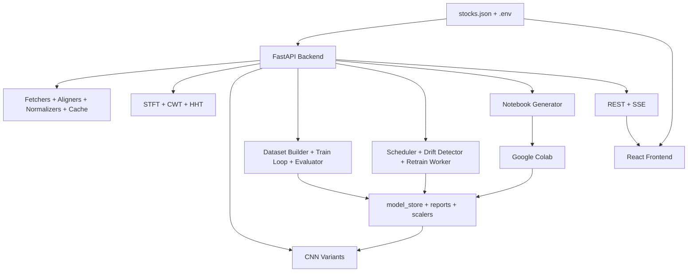

# ChronoSpectra

ChronoSpectra is a configuration-driven financial time-series forecasting platform built with a FastAPI backend and a React + TypeScript frontend. It supports end-to-end workflows for data ingestion, signal transforms, CNN-based prediction, model comparison, live monitoring, and optional retraining.

## What This Project Is

ChronoSpectra is a financial time-series forecasting and analysis system.

In practical terms, it is a full-stack application that takes historical market data, transforms it into signal representations (such as STFT/CWT/HHT), and produces stock price forecasts using CNN-based models. It also includes live monitoring, model comparison, and retraining workflows for iterative model improvement.

## Table Of Contents

1. [Live Demo And Screenshots](#live-demo-and-screenshots)
2. [What This Project Does](#what-this-project-does)
3. [Core Features](#core-features)
4. [Tech Stack](#tech-stack)
5. [Architecture At A Glance](#architecture-at-a-glance)
6. [Repository Structure](#repository-structure)
7. [Getting Started](#getting-started)
8. [Configuration](#configuration)
9. [Training And Retraining Workflows](#training-and-retraining-workflows)
10. [Model Modes](#model-modes)
11. [API And Route References](#api-and-route-references)
12. [Development Commands](#development-commands)
13. [Artifacts And Persistence](#artifacts-and-persistence)
14. [Troubleshooting](#troubleshooting)
15. [Documentation Index](#documentation-index)

## Live Demo And Screenshots

### Live Deployment

- Live App: [`https://chronospectra.gabrieljames.me/`](https://chronospectra.gabrieljames.me/)

- Repository: [`https://github.com/gabsgj/chronospectra`](https://github.com/gabsgj/chronospectra)

### Screenshots


## What This Project Does

ChronoSpectra helps you analyze and forecast stock movements through a configurable pipeline:

1. Fetches market data and related context (index, FX where configured).
2. Aligns and normalizes time-series inputs.
3. Builds signal representations (STFT/CWT/HHT).
4. Runs CNN inference for selected model modes.
5. Serves output to a visualization-focused frontend.
6. Supports periodic retraining and drift-aware refresh workflows.

The entire app is governed by a shared root configuration file: `stocks.json`.

## Core Features

- Single config spine shared by frontend and backend (`stocks.json`).
- Multi-exchange support with exchange-level data-provider settings.
- Signal transforms: STFT, CWT, and HHT.
- Multiple modeling strategies:
	- `per_stock`
	- `unified`
	- `unified_with_embeddings`
	- `both` (comparison-oriented setup)
- Live testing with stream-driven updates and closed-market fallback behavior.
- Local startup actions for optional training or retraining refresh.
- Notebook generation for Colab-first training workflows.
- Compatibility routes for legacy `/api/*` consumers.

## Tech Stack

### Backend

- FastAPI
- Uvicorn
- pandas, NumPy, SciPy
- PyWavelets, EMD-signal
- PyTorch (CPU-friendly runtime path)
- APScheduler

### Frontend

- React 19 + TypeScript
- Vite
- React Router
- D3
- Tailwind CSS
- Framer Motion

### Tooling

- Docker Compose for local two-service orchestration
- Playwright for optional E2E tests
- ESLint + TypeScript type-check pipeline

## Architecture At A Glance



Backend startup includes:

- configuration loading
- CORS setup from environment configuration
- scheduler initialization for retraining checks
- startup actions for optional training/retraining refresh

## Repository Structure

```text
StockCNN/
|- backend/
|  |- data/
|  |  |- fetchers/
|  |  |- aligners/
|  |  |- normalizers/
|  |  |- cache/
|  |- models/
|  |  |- model_store/
|  |- routes/
|  |- retraining/
|  |- signal_processing/
|  |- training/
|  |- notebooks/
|  |- main.py
|  |- config.py
|  |- startup_actions.py
|  |- requirements.runtime.txt
|  |- requirements.txt
|- frontend/
|  |- src/
|  |  |- api/
|  |  |- components/
|  |  |- contexts/
|  |  |- hooks/
|  |  |- pages/
|  |  |- router/
|  |  |- types/
|  |- package.json
|- docker-compose.yml
|- stocks.json
|- API_REFERENCE.md
|- ARCHITECTURE.md
|- DOCUMENTATION.md
|- README.md
```

## Getting Started

### 1) Prerequisites

- Python 3.12+
- Node.js 22+
- npm 10+
- Docker Desktop (optional but recommended)

### 2) Quick Run With Docker

From the repository root:

```bash
docker compose up --build
```

Default local endpoints:

- Frontend: `http://localhost:5173`
- Backend API: `http://localhost:8000`
- Backend API docs: `http://localhost:8000/docs`
- Backend health: `http://localhost:8000/health`

### 3) Manual Local Run

### Backend

```bash
cd backend
python -m pip install -r requirements.runtime.txt
uvicorn main:app --host 0.0.0.0 --port 8000 --reload
```

### Frontend

```bash
cd frontend
npm install
npm run dev
```

### 4) First Validation Checklist

- Open the frontend and verify stock data loads.
- Open backend docs at `/docs`.
- Verify `/health` returns status `ok`.
- Confirm `stocks.json` contains at least one enabled stock.


## Configuration

ChronoSpectra is intentionally configuration-first.

### Environment Variables

Runtime values can be read from root `.env`, `backend/.env`, and `frontend/.env`.

Common variables:

| Variable | Purpose | Typical Value |
|---|---|---|
| `BACKEND_URL` | Backend base URL used by services/scripts | `http://localhost:8000` |
| `FRONTEND_URL` | Allowed frontend origin(s) for CORS | `http://localhost:5173` |
| `VITE_BACKEND_URL` | Frontend API base URL | `http://localhost:8000` |
| `APP_ENV` | Runtime environment label | `development` |
| `LOG_LEVEL` | Backend log level | `INFO` |

### stocks.json

`stocks.json` controls:

- active model mode
- startup training/retraining behavior
- exchange metadata and market hours
- stock universe and per-stock model settings
- signal-processing defaults
- training and retraining parameters

Key fields you will likely edit:

- `model_mode`
- `local_training.enabled`
- `retrain_on_startup.enabled`
- `stocks[].enabled`
- `stocks[].model.prediction_horizon_days`
- `signal_processing.default_transform`
- `training.epochs`, `training.batch_size`, `training.learning_rate`

## Training And Retraining Workflows

ChronoSpectra supports two practical training modes.

### Colab-First Training (Recommended)

Use generated notebooks and external GPU compute (for example, Colab), then return artifacts to local storage directories.

Why recommended:

- avoids local CUDA setup complexity
- keeps local runtime fast and stable
- aligns well with notebook generator workflow

### Local Training

Enable local training in `stocks.json` only when intentionally regenerating artifacts:

```json
"local_training": {
	"enabled": true
}
```

After training, disable it for normal app runtime.

### Startup Retraining

`retrain_on_startup.enabled` refreshes stale/missing models at backend startup.

Important precedence:

- If both `local_training.enabled` and `retrain_on_startup.enabled` are true, local training takes precedence.

## Model Modes

| Mode | Description | Typical Use |
|---|---|---|
| `per_stock` | One checkpoint per stock | Stock-specific specialization |
| `unified` | One shared checkpoint | Simpler multi-stock baseline |
| `unified_with_embeddings` | Shared checkpoint with stock embeddings | Shared model with identity awareness |
| `both` | Comparison-oriented mode availability | Evaluation and benchmarking |

Runtime notes:

- Prediction mode defaults to config.
- Live UI can request specific mode behavior (if available).
- Forced mode requires matching artifacts, or backend returns a clear error.

## API And Route References

Primary backend route groups:

- `/data`
- `/signal`
- `/model`
- `/training`
- `/retraining`
- `/live`
- `/notebook`

System routes:

- `/health`
- `/config`
- `/docs`

Compatibility:

- Legacy `/api/*` aliases are still mounted for backward compatibility.

For endpoint-level details, see `API_REFERENCE.md`.

## Development Commands

### Frontend

```bash
cd frontend
npm run dev
npm run type-check
npm run lint
npm run build
```

### Frontend E2E (Optional)

```bash
cd frontend
npm run test:e2e
```

### Backend Syntax Check

```bash
cd d:/StockCNN
python -m compileall backend
```

## Artifacts And Persistence

Important generated paths:

- `backend/models/model_store/per_stock/`
- `backend/models/model_store/unified/`
- `backend/models/model_store/scalers/`
- `backend/models/model_store/reports/`
- `backend/retraining/prediction_history/`
- `backend/retraining/retrain_log.json`

These artifacts are required for prediction, comparison, backtesting, and retraining history visibility.

## Troubleshooting

### Frontend Cannot Reach Backend

- Ensure backend is running at expected host/port.
- Verify `VITE_BACKEND_URL` in frontend environment config.
- Verify backend CORS origins include frontend URL.

### Live Stream Fails

- Confirm endpoint connectivity for `/live/stream/{stock_id}`.
- Verify model artifacts exist for selected or forced mode.
- Check backend logs for scaler/checkpoint loading issues.

### Missing Model Errors

- Confirm artifacts are present in `backend/models/model_store/`.
- If forcing a model mode, ensure matching mode artifacts exist.

### Slow Or Unstable Startup

- Disable startup training/retraining flags when not needed.
- Use runtime dependencies (`requirements.runtime.txt`) for normal local runs.

## Documentation Index

- `README.md`: project entry point and setup
- `DOCUMENTATION.md`: deep operational guide
- `ARCHITECTURE.md`: architecture and design decisions
- `API_REFERENCE.md`: endpoint catalog
- `TASKS.md`: implementation task tracking
- `PROGRESS.md`: progress timeline


## License

Add your license section here (for example, MIT) if not already defined elsewhere.

